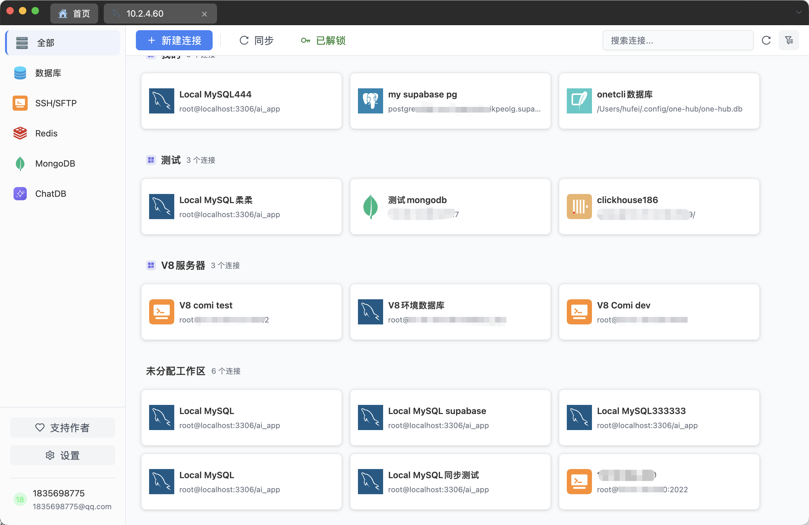
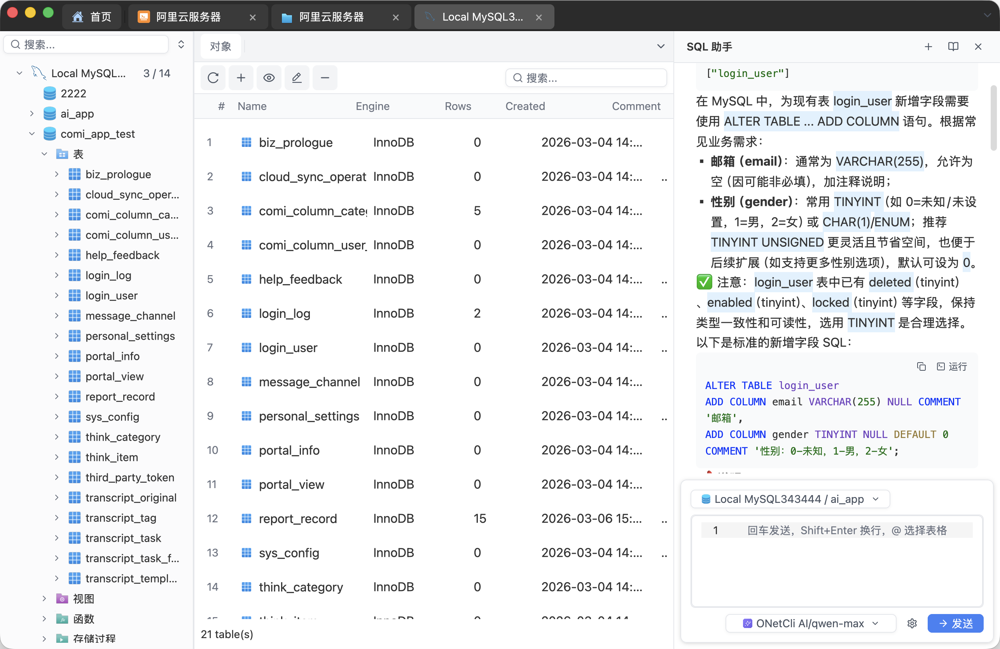
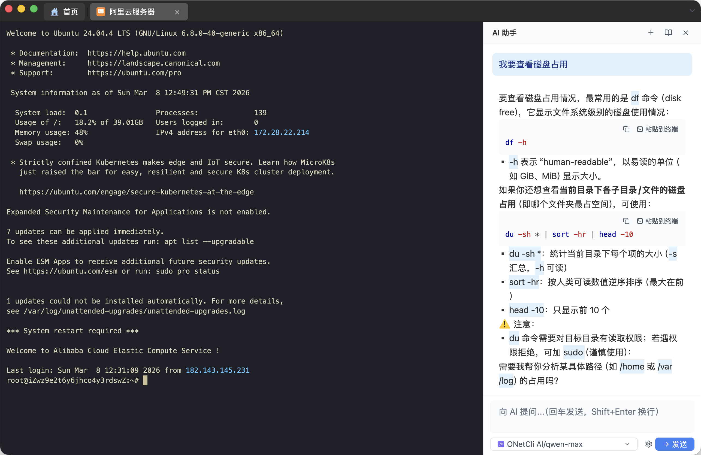
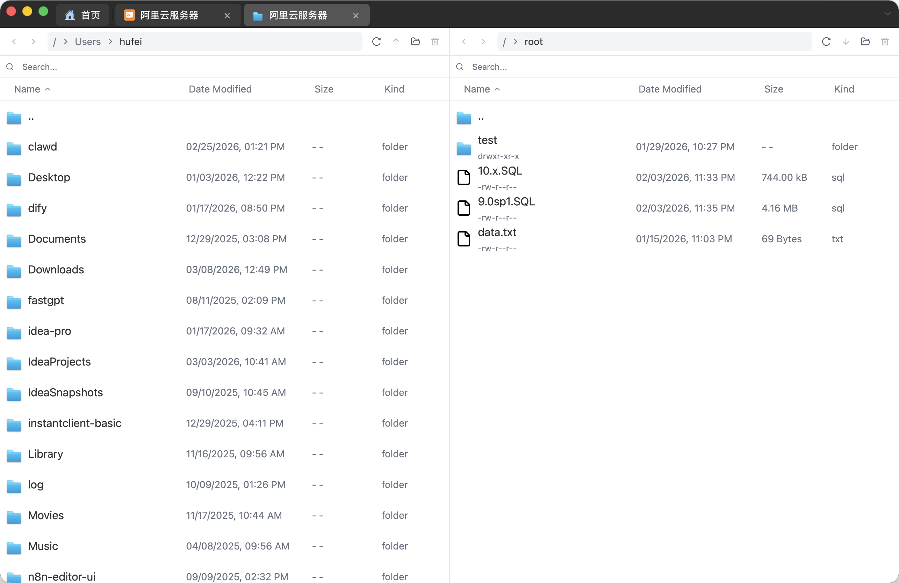
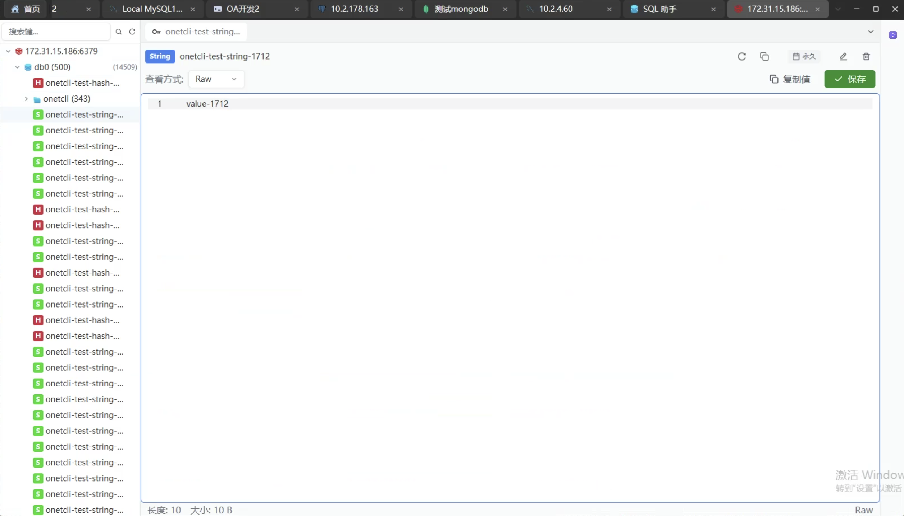
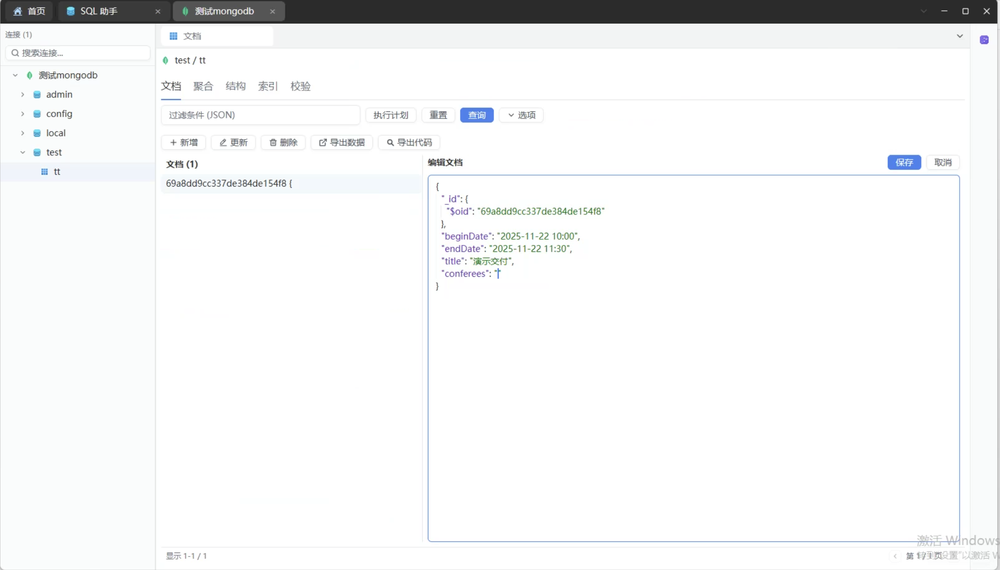
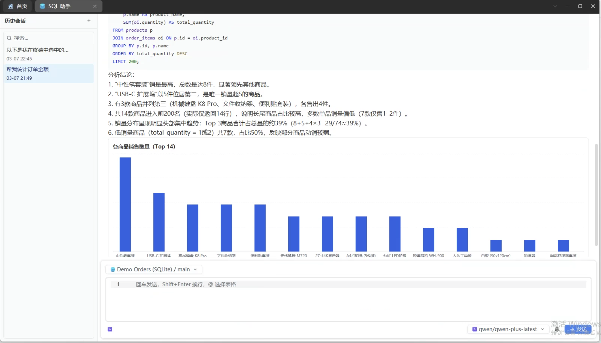

<p align="center">
  
</p>

<h1 align="center">OnetCli</h1>

<p align="center">
  <strong>O</strong>ne <strong>Net</strong> <strong>Cl</strong>ient — A cross-platform desktop client for databases, SSH, terminals & AI, all in one place.
</p>

<p align="center">
  Built with <a href="https://gpui.rs">GPUI</a> · GPU-accelerated · Native performance
</p>

<p align="center">
  <a href="README_CN.md">中文</a> ·
  <a href="#installation">Installation</a> ·
  <a href="#features">Features</a> ·
  <a href="#screenshots">Screenshots</a> ·
  <a href="CONTRIBUTING.md">Contributing</a>
</p>

---

<!-- Replace with actual screenshot -->
<p align="center">
  
</p>

## Features

**Database Management** — Connect to PostgreSQL, MySQL, SQLite, SQL Server, Oracle, and ClickHouse from a single interface.

**Redis** — Dedicated Redis viewer with key browsing, value inspection, and cluster support.

**MongoDB** — MongoDB explorer with collection browsing, document viewing, and query support.

**SSH & SFTP** — Integrated SSH terminal and SFTP file manager with key-based authentication.

**Terminal** — Built-in local terminal with multi-tab workflows.

**AI Assistant** — Chat with AI directly inside the app. Supports natural language to SQL, query explanation, BI-style data analysis, and chart generation — powered by streaming LLM integration.

**Cloud Sync** — Sync connections and settings across devices with encrypted key storage (AES-GCM, Ed25519).

**Themes & i18n** — Light / dark mode. Supports English, Simplified Chinese, and Traditional Chinese.

## Screenshots

| Database | SSH |
|:-:|:-:|
|  |  |

| SFTP | Redis |
|:-:|:-:|
|  |  |

| MongoDB | AI Chat |
|:-:|:-:|
|  |  |

## Platform Support

| Platform | Architecture | Rendering |
|----------|-------------|-----------|
| macOS | aarch64, x86_64 | Metal |
| Linux | x86_64 | Vulkan |
| Windows | x86_64 | — |

## Installation

### Prerequisites

- Rust (2024 edition)
- Platform-specific dependencies (see below)

### System Dependencies

**macOS / Linux:**

```bash
./script/bootstrap
```

**Windows (PowerShell):**

```powershell
.\script\install-window.ps1
```

### Build & Run

```bash
cargo run -p main
```

### macOS Troubleshooting

If macOS blocks the app from opening after installing the DMG ("Apple cannot check it for malicious software"), run:

```bash
sudo xattr -rd com.apple.quarantine /Applications/OnetCli.app
```

### Oracle Support

Oracle connections require [Oracle Instant Client](https://www.oracle.com/database/technologies/instant-client/downloads.html) (Basic package) to be installed on your system. Download the version matching your platform and ensure the libraries are in your library search path.

## Development

```bash
# Build
cargo build

# Test
cargo test --all

# Lint
cargo clippy -- --deny warnings

# Format check
cargo fmt --check

# Spell check
typos
```

See [CONTRIBUTING.md](CONTRIBUTING.md) for the full development guide.

## Tech Stack

| Category | Technologies |
|----------|-------------|
| UI Framework | [GPUI](https://gpui.rs) (from Zed editor) |
| Databases | tokio-postgres, mysql_async, rusqlite, tiberius, oracle, clickhouse, redis, mongodb |
| SSH/SFTP | russh, russh-sftp |
| Terminal | alacritty_terminal |
| Text Editing | ropey, tree-sitter, sqlparser |
| AI | llm-connector (streaming) |
| Encryption | aes-gcm, sha2, ed25519 |
| i18n | rust-i18n |

## License

Licensed under [Apache License 2.0](LICENSE-APACHE).

The distribution and use of the OnetCli application are additionally subject to the [OnetCli Supplementary License](ONETCLI_LICENSE), which adds the following restrictions on top of Apache 2.0:

- No redistribution, resale, or repackaging as a standalone product
- No creating competing products or services based on this software
- No hosting on unauthorized distribution platforms

For licensing inquiries, contact xiaofei.hf@gmail.com.
